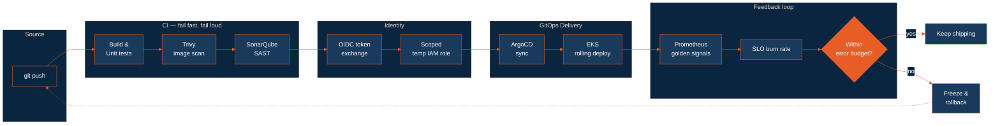

<div align="center">


<a href="https://git.io/typing-svg">
  
</a>

<br /><br />

<a href="https://www.linkedin.com/in/vaibhavsingh79/">
  
</a>
<a href="mailto:vaibhavsingh8829@gmail.com">
  
</a>
<a href="https://leetcode.com/u/YOUR_LEETCODE_HANDLE/">
  
</a>
<a href="https://stackoverflow.com/users/17320810/vaibhav-singh">
  
</a>


</div>

---

## `whoami`

```yaml
role:      Associate Cloud Engineer — Network & Security @ Minfy Technologies
focus:     production infrastructure, reliability, and the paths code takes to get there
domains:
  - CI/CD & GitOps          # GitHub Actions (OIDC), ArgoCD, Jenkins
  - Observability & SLOs    # Prometheus, Grafana, CloudWatch Metric Math
  - Kubernetes on AWS       # EKS, Helm, Network Policies, IRSA
  - Infrastructure as Code  # Terraform, CloudFormation
  - Zero-trust networking   # VPC Links, private ingress, least-privilege IAM
automates_with: [Python, Go, Bash, HCL]
certified:      [AWS Solutions Architect Associate, Azure Administrator AZ-104]
currently:      going deeper on distributed systems + platform engineering
```

> I care about the boring parts that keep things up: failover that doesn't page you at 3 AM,
> pipelines that fail loudly and early, and infrastructure you can delete and rebuild from a repo.

<br />

## How I Think About Delivery



<br />

## Toolchain

<table>
<tr>
<td valign="top" width="50%">

**Cloud & Compute**


**Containers & Orchestration**


**Infrastructure as Code**


</td>
<td valign="top" width="50%">

**CI/CD**


**Observability & Security**


**Languages & Runtime**


</td>
</tr>
</table>

<div align="center">


</div>

<br />

## Things I've Built

<table>
<tr>
<td width="50%" valign="top">

### Zero-Trust IaC Generation Platform
`Python` `FastAPI` `Pydantic` `Jinja2` `Terraform` `Cognito` `OIDC`

Replaced static AWS credentials for **40+ engineers** with GitHub Actions OIDC — short-lived signed tokens exchanged for scoped temporary IAM roles. No long-lived keys, no rotation overhead.

<details>
<summary><b>How it works</b></summary>

<br />

- A workflow requests an OIDC token from GitHub's identity provider; an IAM trust policy scoped to the repo and branch exchanges it for a temporary role. Nothing durable is ever stored.
- Pydantic models validate every input — malformed CIDRs, overlapping subnets, bad tags — and reject them *before* Terraform touches an account.
- Jinja2 renders the validated model into VPC / subnet / IAM HCL. What used to be an afternoon of copy-paste is now a form submission.
- Stateless FastAPI backend behind Cognito (SRP), React UI, so multiple engineers can generate concurrently without stepping on each other.

</details>

</td>
<td width="50%" valign="top">

### Secure Microservices Delivery Pipeline
`Kubernetes` `ArgoCD` `Trivy` `SonarQube` `Prometheus` `Grafana`

Shift-left DevSecOps: Trivy image scanning and SonarQube SAST gate the build on critical/high CVEs. ArgoCD drives GitOps delivery with drift detection and zero-downtime rollouts.

<details>
<summary><b>How it works</b></summary>

<br />

- The build fails on critical and high-severity CVEs rather than warning about them — a scanner nobody blocks on is just a log file.
- ArgoCD reconciles cluster state against Git continuously, so manual `kubectl edit` drift gets reverted instead of silently persisting.
- Grafana dashboards track the four golden signals (latency, traffic, errors, saturation) against explicit SLOs.
- Cluster hardening: zero-trust Network Policies (default deny), least-privilege IRSA per workload, liveness/readiness probes so the cluster self-heals before a human notices.

</details>

</td>
</tr>
<tr>
<td width="50%" valign="top">

### Mini Vercel — Serverless Container Orchestration
`Python` `ECS Fargate` `Terraform` `ECR` `CloudWatch`

A small PaaS modeled on Vercel. A Python CLI triggers Docker builds, semantic versioning, and immutable ECR pushes; modular Terraform provisions an isolated VPC, subnets, and ALB **per deployment** for multi-tenant isolation.

<details>
<summary><b>How it works</b></summary>

<br />

- Immutable ECR tags mean a deploy is always reproducible — no `:latest` ambiguity when you need to know what's actually running.
- Each tenant gets its own network boundary rather than sharing a VPC with security-group gymnastics.
- CPU/memory target-tracking autoscaling plus Spot capacity cut non-production compute **~40%**.
- Structured CloudWatch JSON logging so failures are queryable instead of grep-able.

</details>

</td>
<td width="50%" valign="top">

### Serverless Data-Ingestion Pipeline
`Step Functions` `Lambda` `Spot Fargate` `AWS`

Replaced a manual multi-script workflow. Fargate handles **1 GB+ payloads** that blow past Lambda's 15-minute ceiling, while Step Functions own orchestration, retries, and error paths.

<details>
<summary><b>How it works</b></summary>

<br />

- Step Functions make the state machine explicit — retries, backoff, and failure branches live in the definition, not in someone's memory of the run order.
- Lambda handles the small/fast stages; work that exceeds the 15-minute limit is handed to Fargate tasks instead of being awkwardly chunked.
- Spot capacity for the heavy stages cut compute cost **~70%**, with the state machine handling interruption retries.

</details>

</td>
</tr>
</table>

<br />

## Reliability Work in Production

<table>
<tr><th align="left" width="30%">Area</th><th align="left">What I did</th><th align="left" width="22%">Outcome</th></tr>
<tr>
<td><b>Private API ingress</b></td>
<td>Designed API Gateway ingress over VPC Links to a shared, EKS-provisioned internal NLB, with a senior cloud architect.</td>
<td>Removed redundant load balancers; lower infra spend</td>
</tr>
<tr>
<td><b>Traffic controls</b></td>
<td>Rate limiting, burst capacity, and IP allow-listing via IAM resource policies scoped to corporate, GCP, and NAT-gateway ranges.</td>
<td>Granular, auditable access control</td>
</tr>
<tr>
<td><b>Alerting that doesn't cry wolf</b></td>
<td>CloudWatch + EventBridge monitoring for active-passive VPNs and the AWS Health stream. Metric Math group-health checks suppress failover false positives; SNS alerts are buffered.</td>
<td>Materially less alert noise</td>
</tr>
<tr>
<td><b>Network-layer support</b></td>
<td>Resolved 20+ production tickets across EC2/VPC connectivity; audited security groups and NACLs.</td>
<td>Closed unused ports, tighter attack surface</td>
</tr>
<tr>
<td><b>Consensus components (DRDO)</b></td>
<td>Python and C++ contributions to a secure blockchain system under a Ministry of Defence project.</td>
<td>Documented reliability improvements</td>
</tr>
</table>

<br />

## GitHub Activity

<div align="center">


<br /><br />


<br /><br />


</div>

<br />

## Currently

```console
$ kubectl get roadmap -o wide

NAME                       STATUS        NOTES
distributed-systems        In Progress   consensus, partitioning, failure modes
platform-engineering       In Progress   golden paths, developer self-service
dsa-cpp                    Ongoing       100+ LeetCode
cka                        Planned       next certification target
```

<br />

<div align="center">

**Reach me:** [vaibhavsingh8829@gmail.com](mailto:vaibhavsingh8829@gmail.com) · [LinkedIn](https://www.linkedin.com/in/vaibhavsingh79/)

<sub>Night owl. Most of these commits have timestamps that prove it.</sub>


</div>
